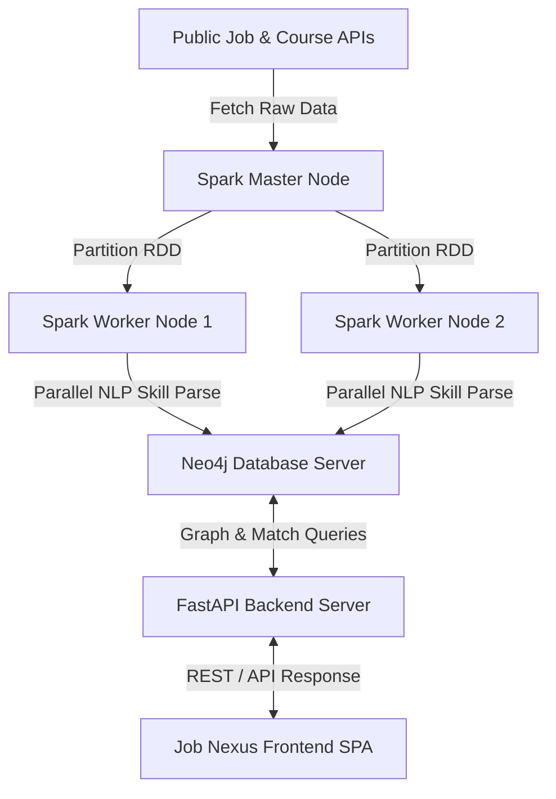

# JOB NEXUS

A career recommendation engine that matches your skills to relevant jobs using TF-IDF vectorization and cosine similarity, with a Neo4j graph backend and an interactive glassmorphic dashboard.

**Live demo**: [https://sahityabiswas.github.io/JOB_NEXUS](https://sahityabiswas.github.io/JOB_NEXUS) (splash) → [https://job-nexus-rt9c.onrender.com](https://job-nexus-rt9c.onrender.com) (app)

---

## Features

- **Skill Autocomplete** — start typing and the system suggests normalized skills from the database
- **Filter & Sort** — narrow results by category, location, company; sort by score or title
- **Score Breakdown** — see exactly which skills matched and which are missing for each job
- **Proficiency Slider** — set Beginner/Intermediate/Advanced/Expert per skill; scores adjust accordingly
- **Confidence Indicator** — green/yellow/red dot shows how reliable each match is
- **Skill Normalization** — aliases (e.g. `html` → `HTML`) are transparent, with the original shown as a tooltip
- **Share Profile** — copy your skill + proficiency setup as a shareable link
- **Export PDF** — download recommendations as a PDF
- **Interactive Graph** — visualise the relationship between you, skills, jobs, and courses
- **Mobile Responsive** — works on phones and tablets

---

## Tech Stack

| Layer | Technology |
|-------|-----------|
| Backend | FastAPI (Python) |
| Database | Neo4j AuraDB (graph) |
| Vector Matching | scikit-learn (TF-IDF, cosine similarity) |
| NLP | spaCy (skill extraction & normalization) |
| Frontend | Vanilla JS SPA with glassmorphic CSS |
| Graph Viz | Vis.js |
| PDF Export | html2pdf.js |
| Deployment | Render |

---

## System Architecture

The application is structured into three decoupled layers designed for horizontal scaling:



### 1. Distributed Ingestion Layer (Apache Spark)
- **Script**: `src/ingest_spark.py`
- **Processing Model**:
  - The Spark Master (Driver) fetches raw records from public job APIs (**Remotive**, **The Muse**, **Jobicy**) and **Coursera** courses.
  - The records are loaded into a Spark RDD (Resilient Distributed Dataset) and sliced into concurrent partitions.
  - Workers run independent NLP preprocessing and normalization routines using spaCy. This extracts and maps skill variations (e.g., `pyton`, `python3`, `py` -> `Python`).
  - To bypass single-threaded database write bottlenecks, the workers use Spark's `foreachPartition` action. Each worker thread opens a concurrent, direct network connection to the Neo4j database to stream its partition of nodes and edges in parallel.

### 2. Semantic Property Graph Schema (Neo4j)
- **Entity Schema**:
  - `(Job {id, title, company, location, category})` — Extracted job roles.
  - `(Skill {name})` — Normalized career skill prerequisites.
  - `(Course {id, name, url})` — Educational courses bridging skill gaps.
- **Semantic Relationships**:
  - `(Job)-[:REQUIRES]->(Skill)` — Prerequisites for employment.
  - `(Course)-[:TEACHES]->(Skill)` — Core topics covered in courses.
- **Optimization**: Unique database constraints are initialized on `j.id`, `s.name`, and `c.id` to guarantee linear lookup speeds.

### 3. Web Service & Matching Engine (FastAPI + Vis.js)
- **Mathematical Vector Matching**:
  - The engine uses **TF-IDF (Term Frequency-Inverse Document Frequency) Vectorization** combined with **Cosine Similarity** to compute matching scores between the user's skill set and job requirements.
  - **Diluted Cosine Similarity**: Vector angle calculation naturally factors in extraneous skills. This dilutes pure overlap scores to prevent inflated match percentages, providing a realistic assessment of skill alignment.
- **Premium Dashboard Interface**:
  - **Ambient Physics Orbs**: Background elements floating organically using hardware-accelerated CSS keyframes.
  - **Job Nexus Form**: Glassmorphic search cards containing interactive search chips.
  - **Live Progress Grid**: Displays location, company, and progress bars illustrating match accuracy.
  - **Constellation Graph**: Renders the physics-based graph network of skills, jobs, and courses directly in the browser using Vis.js.
  - **"What-If" Learning Simulator**: Allows you to click any missing skill (red gap chips) to instantly simulate learning it. This updates your in-memory profile and instantly redraws the visual graph and matching list.

---

## Setup

```bash
# 1. Create virtual environment
python -m venv venv
.\venv\Scripts\Activate.ps1   # Windows
source venv/bin/activate       # macOS/Linux

# 2. Install dependencies
pip install -r requirements.txt
python -m spacy download en_core_web_sm

# 3. Configure Neo4j connection
cp config.example.json config.json
# Edit config.json with your Neo4j AuraDB credentials
# Or set env vars: NEO4J_URI, NEO4J_USER, NEO4J_PASS

# 4. Ingest data into Neo4j
python src/ingest_simple.py

# 5. Start the server
python src/api.py
```

Open **http://localhost:8000** in your browser.

---

## Project Structure

```
├── src/
│   ├── api.py              # FastAPI routes (recommend, graph, filters, skills, normalize)
│   ├── db_neo4j.py         # Neo4j driver connection pool
│   ├── recommender.py      # Matching engine (graph overlap + TF-IDF cosine similarity)
│   ├── normalize.py        # Skill alias mapping & canonical form lookup
│   └── ingest_simple.py    # Populates Neo4j with job and course data
├── static/
│   └── index.html          # Single-page application frontend
├── requirements.txt
├── config.example.json
├── Procfile                # Render deployment start command
├── render.yaml             # Render service configuration
└── README.md
```

---

## API Endpoints

| Endpoint | Description |
|----------|-------------|
| `GET /` | Serves the SPA |
| `GET /api/skills/search?q=` | Autocomplete skill lookup |
| `GET /api/skills/normalize?q=` | Check canonical form of a skill |
| `GET /api/skills/all` | List all canonical skills |
| `GET /api/filters` | Available categories, locations, companies |
| `GET /api/recommend?skills=&proficiencies=&mode=&...` | Get job recommendations |
| `GET /api/graph?skills=&mode=` | Get graph visualization data |

---

## Deployment

The app is configured for deployment on **Render**. Push to GitHub and Render auto-deploys from `main`.

Required environment variables in Render:
- `NEO4J_URI`
- `NEO4J_USER`
- `NEO4J_PASS`
