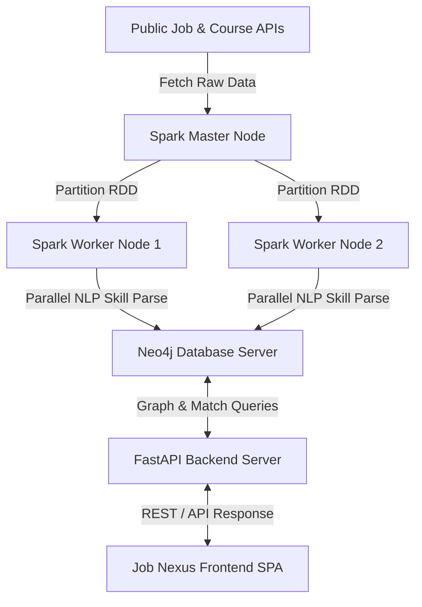

# Job Nexus
### Distributed Graph-Based Multi-Domain Career Recommendation Engine

Welcome to **Job Nexus**, a production-grade distributed batch-processing and career recommendation engine. This system pulls live jobs from dynamic public APIs, fetches learning pathways from Coursera, parses and processes NLP skill extraction in parallel across an **Apache Spark Master-Worker Cluster**, models these relationships inside a **Neo4j Semantic Graph Database**, and serves a gorgeous **interactive glassmorphic dashboard** featuring real-time Cosine Similarity matching and a "What-If" career path simulator.

---

## 🌌 System Architecture

The application is structured into three decoupled layers designed for horizontal scaling:



### 1. Distributed Ingestion Layer (Apache Spark)
* **Script**: `src/ingest_spark.py`
* **Processing Model**:
  - The Spark Master (Driver) fetches raw records from public job APIs (**Remotive**, **The Muse**, **Jobicy**) and **Coursera** courses.
  - The records are loaded into a Spark RDD (Resilient Distributed Dataset) and sliced into concurrent partitions.
  - Workers run independent NLP preprocessing and normalization routines using spaCy. This extracts and maps skill variations (e.g., `pyton`, `python3`, `py` -> `Python`).
  - To bypass single-threaded database write bottlenecks, the workers use Spark's `foreachPartition` action. Each worker thread opens a concurrent, direct network connection to the Neo4j database to stream its partition of nodes and edges in parallel.

### 2. Semantic Property Graph Schema (Neo4j)
* **Default Host**: Configured via `config.json` or environment variables
* **Entity Schema**:
  * `(Job {id, title, company, location, category})` — Extracted job roles.
  * `(Skill {name})` — Normalized career skill prerequisites.
  * `(Course {id, name, url})` — Educational courses bridging skill gaps.
* **Semantic Relationships**:
  * `(Job)-[:REQUIRES]->(Skill)` — Prerequisites for employment.
  * `(Course)-[:TEACHES]->(Skill)` — Core topics covered in courses.
* **Optimization**: Unique database constraints are initialized on `j.id`, `s.name`, and `c.id` to guarantee linear lookup speeds.

### 3. Web Service & Matching Engine (FastAPI + Vis.js)
* **Mathematical Vector Matching**:
  - The engine uses **TF-IDF (Term Frequency-Inverse Document Frequency) Vectorization** combined with **Cosine Similarity** to compute matching scores between the user's skill set and job requirements.
  - **Diluted Cosine Similarity**: Vector angle calculation naturally factors in extraneous skills. This dilutes pure overlap scores to prevent inflated match percentages, providing a realistic assessment of skill alignment.
* **Premium Dashboard Interface**:
  - **Ambient Physics Orbs**: Background elements floating organically using hardware-accelerated CSS keyframes.
  - **Job Nexus Form**: Glassmorphic search cards containing interactive search chips (`Excel`, `Python`, `SQL`, `Tableau`).
  - **Live Progress Grid**: Displays location, company, and progress bars illustrating match accuracy.
  - **Constellation Graph**: Renders the physics-based graph network of skills, jobs, and courses directly in the browser using Vis.js.
  - **"What-If" Learning Simulator**: Allows you to click any missing skill (red gap chips) to instantly simulate learning it. This updates your in-memory profile and instantly redraws the visual graph and matching list.

---

## 📂 Directory Structure

```
gddc2026/
├── data/
│   ├── courses.csv                 # Offline course enrichment dataset
│   └── users.csv                   # Mock user profile dataset
├── src/
│   ├── api.py                      # FastAPI App (routing, template rendering, and APIs)
│   ├── db_neo4j.py                 # Neo4j Driver Connection pool singleton
│   ├── ingest_spark.py             # Distributed PySpark parallel ingestion script
│   ├── ingest_simple.py            # Lightweight sequential ingestion script (for local test fallback)
│   ├── normalize.py                # spaCy NLP skill cleaning and alias mapping logic
│   └── recommender.py              # Math matching engine (TF-IDF & Cosine Similarity)
├── static/
│   └── index.html                  # Single-Page Frontend (Job Nexus dashboard)
├── requirements.txt                # Python project dependencies
├── config.example.json             # Database connection template (copy to config.json)
├── .gitignore                      # Git rule exclusions
└── README.md                       # Structured documentation guide
```

---

## 🚀 Setup & Execution

### 1. Python Virtual Environment Setup
Open your terminal in the project root directory and execute:
```bash
# 1. Create the virtual environment
python -m venv venv

# 2. Activate the virtual environment
# On Windows PowerShell:
.\venv\Scripts\Activate.ps1
# On Linux/macOS:
source venv/bin/activate

# 3. Install required dependencies
pip install -r requirements.txt

# 4. Download the NLP models
python -m spacy download en_core_web_sm
```

### 2. Configure Database Connections (Secure Practices)
Copy `config.example.json` to `config.json` and fill in your Neo4j connection details:
```bash
cp config.example.json config.json
```

Credentials can also be set via environment variables (override config.json):
* **Windows PowerShell:** `$env:NEO4J_PASS="your_password"`
* **Linux / macOS:** `export NEO4J_PASS="your_password"`


### 3. Run Ingestion Pipeline
To scrape APIs, execute parallel NLP parsing, and load the data into the Neo4j graph:
```bash
python src/ingest_spark.py
```
*Tip: If you do not have a local installation of Apache Spark on your computer and want to run a quick test, you can run the sequential fallback script instead: `python src/ingest_simple.py`.*

### 4. Start the Web Server
Launch the FastAPI application server:
```bash
python src/api.py
```
Open your web browser and go to **`http://localhost:8000`** to interact with the **Job Nexus** dashboard.

---

## 🎛️ Apache Spark Cluster Deployment Guide

Follow these steps to deploy and run the ingestion pipeline across a physical distributed master-worker cluster:

### Step 1: Initialize the Master Node
Run this command on the Spark master coordinator machine to start the resource manager:
```bash
# Linux / macOS
./sbin/start-master.sh --host <master-ip> --port 7077

# Windows Command Prompt / PowerShell
spark-class org.apache.spark.deploy.master.Master --host <master-ip> --port 7077
```

### Step 2: Register Worker Nodes
Run this command on each worker executor machine to register processing cores and memory with the master:
```bash
# Linux / macOS
./sbin/start-worker.sh spark://<master-ip>:7077

# Windows Command Prompt / PowerShell
spark-class org.apache.spark.deploy.worker.Worker spark://<master-ip>:7077
```

### Step 3: Monitor Cluster Health
Open **`http://<master-ip>:8080`** in your browser. This will load the official Spark Master Web UI where you can track registered worker node addresses, core counts, memory usage, and active tasks.